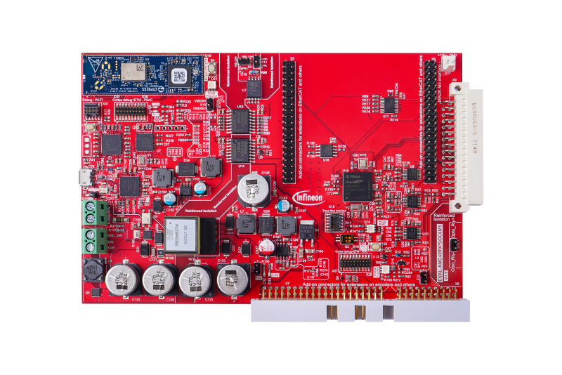

# EVAL-XMC4800PSOC6M5-XMC BSP

## Overview

The EVAL-XMC4800PSOC6M5 is a controller board which fits to modular application design kits (MADK) with M5 connectors. It enables easy evaluation of the supported MADKs and can be used for designing own software extensions. It comes with XMC4800 for inverter & motor control and PSoC™ 6 for Web-based system configuration incl. Wi-Fi connectivity, on-board debugger and programmer for both MCUs, power supply, OPTIGA™  TrustM security solution, Quad-SPI NOR flash and interfaces to connect encoder/resolver and EtherCAT complete the board.

To use code from the BSP, simply include a reference to `cybsp.h`.

## Features

### Kit Features:

* XMC4800 for inverter & motor control
* PSoC62+Murata 1LV Module incl. Wi-Fi connectivity and configuration GUI 
* Interface to MADKs with M5 connector
* ModusToolBox™ enabled
* USB on-board debugger/programmer for both MCUs
* Add-on connectors for extension on EtherCAT and external encoder/resolver circuitries
* On-board 24V / 15W flyback DC/DC
* On-board OPTIGA™  TrustM security solution
* Isolated CAN interface

### Kit Contents:

* EVAL-XMC4800PSOC6M5 board
* USB cable

## BSP Configuration

The BSP has a few hooks that allow its behavior to be configured. Some of these items are enabled by default while others must be explicitly enabled. Items enabled by default are specified in the EVAL-XMC4800PSOC6M5-XMC.mk file. The items that are enabled can be changed by creating a custom BSP or by editing the application makefile.

Components:
* Device specific category reference (e.g.: CAT1) - This component, enabled by default, pulls in any device specific code for this board.

Defines:
* CYBSP_WIFI_CAPABLE - This define, disabled by default, causes the BSP to initialize the interface to an onboard wireless chip if it has one.
* CY_USING_HAL - This define, enabled by default, specifies that the HAL is intended to be used by the application. This will cause the BSP to include the applicable header file and to initialize the system level drivers.
* CYBSP_CUSTOM_SYSCLK_PM_CALLBACK - This define, disabled by default, causes the BSP to skip registering its default SysClk Power Management callback, if any, and instead to invoke the application-defined function `cybsp_register_custom_sysclk_pm_callback` to register an application-specific callback.

See the [BSP Setttings][settings] for additional board specific configuration settings.

## API Reference Manual

The EVAL-XMC4800PSOC6M5-XMC Board Support Package provides a set of APIs to configure, initialize and use the board resources.

See the [BSP API Reference Manual][api] for the complete list of the provided interfaces.

## More information
* [EVAL-XMC4800PSOC6M5-XMC BSP API Reference Manual][api]
* [EVAL-XMC4800PSOC6M5-XMC Documentation](https://www.infineon.com/eval-xmc4800psoc6m5)
* [Cypress Semiconductor, an Infineon Technologies Company](http://www.cypress.com)
* [Infineon GitHub](https://github.com/infineon)
* [ModusToolbox™](https://www.cypress.com/products/modustoolbox-software-environment)

[api]: https://infineon.github.io/TARGET_EVAL-XMC4800PSOC6M5-XMC/html/modules.html
[settings]: https://infineon.github.io/TARGET_EVAL-XMC4800PSOC6M5-XMC/html/md_bsp_settings.html

---
© Cypress Semiconductor Corporation (an Infineon company) or an affiliate of Cypress Semiconductor Corporation, 2019-2022.